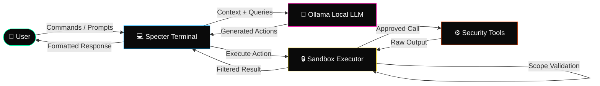

<p align="center">
  
</p>

<p align="center">
  <a href="https://git.io/typing-svg">
    
  </a>
</p>

<p align="center">
  
  
  
  <br />
  
  
  
  
  
  
</p>

---

```ascii
╔══════════════════════════════════════════════════════════════╗
║  ███████╗██████╗ ███████╗ ██████╗████████╗███████╗██████╗   ║
║  ██╔════╝██╔══██╗██╔════╝██╔════╝╚══██╔══╝██╔════╝██╔══██╗  ║
║  ███████╗██████╔╝█████╗  ██║        ██║   █████╗  ██████╔╝  ║
║  ╚════██║██╔═══╝ ██╔══╝  ██║        ██║   ██╔══╝  ██╔══██╗  ║
║  ███████║██║     ███████╗╚██████╗   ██║   ███████╗██║  ██║  ║
║  ╚══════╝╚═╝     ╚══════╝ ╚═════╝   ╚═╝   ╚══════╝╚═╝  ╚═╝  ║
║                                                                ║
║  Offensive AI Security Terminal v3.0                          ║
║  100% Offline · Air-Gapped · No Telemetry                     ║
╚══════════════════════════════════════════════════════════════╝
```

## ⚡ Architecture



## 🚀 Quick Start

```bash
# 1. Clone the repository
git clone https://github.com/Ruby570bocadito/Specter-Terminal.git
cd Specter-Terminal

# 2. Install dependencies
pip install -r requirements.txt

# 3. Ensure Ollama is running with a compatible model
ollama pull mistral:7b  # or llama3, dolphin-mixtral, etc.

# 4. Launch Specter-Terminal
python specter.py
```

> **Requirements:** Python 3.10+, Ollama installed and running, Linux/WSL environment.

## 🎯 Features

| Feature | Description |
|---------|-------------|
| 🧠 **Local LLM Integration** | Full Ollama integration (mistral, llama3, qwen, gemma, deepseek). Zero data leaves your machine. |
| 🔐 **Sandboxed Execution** | Allow-all with intelligent blocklist, scope validation, rate limiting, auto-sudo approval. |
| 🛠️ **MCP Advanced** | Tool templates, chaining, auto-discovery, output parsers, interactive prompt builder. |
| 🕵️ **AI Skills** | Recon, OSINT, Web, Post-Exploitation, Forensics, Active Directory, Reporting. |
| 🎮 **Orchestrator** | Parallel sub-agents: Recon → Exploit → Analyst → Reporter. Conditional workflows. |
| 📖 **Wordlists** | 700+ integrated entries + support for rockyou.txt, SecLists, external archives. |
| 📊 **Workflows** | Conditional steps, loops, variables, interactive editor, real-time skill execution. |
| 📋 **Guardrails** | Prompt injection detection, sensitive data filtering, tool approval gates, audit logs. |
| 🔌 **Plugin System** | Custom skill loader, community plugins, extensible tool registry. |
| 📡 **Offline Mode** | Full capability without internet. Air-gapped by design. No telemetry. |

## ⌨️ Available Commands

| Command | Description |
|---------|-------------|
| `/help` | Show interactive help menu |
| `/scan <target>` | Run AI-guided reconnaissance |
| `/exploit <target>` | Launch exploitation sequence |
| `/recon <domain>` | OSINT and subdomain enumeration |
| `/post <session>` | Post-exploitation actions |
| `/forensics <path>` | Forensic analysis on target |
| `/report` | Generate pentest report |
| `/workflow <name>` | Execute saved workflow |
| `/skill <name>` | Load a security skill |
| `/sandbox <cmd>` | Run command in sandbox |
| `/config` | Edit configuration |
| `/quit` | Exit Specter-Terminal |

## 🖥️ Terminal Preview

```ascii
 ╭──────────────────────────────────────────────────────╮
 │  SPECTER › Offensive AI Security Terminal  v3.0      │
 ├──────────────────────────────────────────────────────┤
 │                                                      │
 │  [user@specter]$ /scan 10.0.1.0/24                   │
 │                                                      │
 │  ◇ Loading skill: network-recon...                   │
 │  ◇ Querying Ollama (mistral:7b)...                   │
 │  ◇ AI suggests: Nmap SYN scan + Service enum         │
 │  ◇ Executing: nmap -sS -sV -O 10.0.1.0/24           │
 │  ◇ Sandbox: approved ✓                                │
 │                                                      │
 │  ┌─ Results ─────────────────────────────────────┐   │
 │  │  10.0.1.1   → 80/tcp   Apache 2.4.41          │   │
 │  │  10.0.1.5   → 22/tcp   OpenSSH 8.2p1          │   │
 │  │  10.0.1.10  → 443/tcp  nginx 1.18.0           │   │
 │  │  10.0.1.15  → 445/tcp  Samba                   │   │
 │  └───────────────────────────────────────────────┘   │
 │                                                      │
 │  ◇ AI analysis: 4 hosts discovered.                  │
 │  ◇ Recommending: Web vuln scan on 10.0.1.1           │
 │                                                      │
 │  [user@specter]$ _                                    │
 │                                                      │
 ╰──────────────────────────────────────────────────────╯
```

## 🏗️ Project Structure

```
Specter-Terminal/
├── core/
│   ├── engine.py          # Main execution engine
│   ├── orchestrator.py    # AI orchestrator
│   └── sandbox.py         # Sandbox executor
├── skills/
│   ├── recon/            # Reconnaissance skills
│   ├── exploit/          # Exploitation skills
│   ├── post/             # Post-exploitation
│   └── forensics/        # Forensics skills
├── plugins/
│   └── community/        # Community plugins
├── config/
│   ├── settings.yaml     # Global configuration
│   └── wordlists/        # Built-in wordlists
├── specter.py            # Entry point
├── requirements.txt      # Dependencies
└── README.md             # This file
```

## 🛡️ Security & Ethics

Specter-Terminal is designed for **authorized security professionals only**. Always:

- ✅ Obtain explicit written permission before testing any system
- ✅ Use only in isolated, air-gapped environments for production testing
- ✅ Follow responsible disclosure practices
- ❌ Never use against systems you don't own or have written authorization for
- ❌ Never upload sensitive findings to public repositories

> **Disclaimer:** The authors assume no liability for misuse. You are responsible for complying with all applicable laws.

## 🤝 Contributing

Pull requests are welcome. For major changes, please open an issue first to discuss what you'd like to change.

```bash
# Development setup
git clone https://github.com/Ruby570bocadito/Specter-Terminal.git
cd Specter-Terminal
pip install -r requirements-dev.txt
```

## 📄 License

[MIT](LICENSE) © 2025 [Ruby570bocadito](https://github.com/Ruby570bocadito)

---

<p align="center">
  
</p>

<p align="center">
  <sub>Built with ❤️ for the security community · 100% Air-Gapped · Zero Trust · Zero Compromise</sub>
</p>
